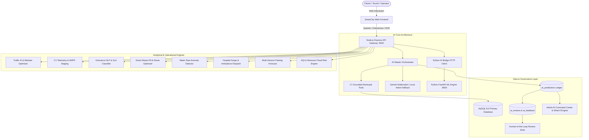

# SMARTCITY AI — SYSTEM ARCHITECTURE SPECIFICATION
**Platform**: Gorakhpur Smart City Management Platform (Uttar Pradesh)  
**Version**: 2.5.0 Enterprise  

---

## 1. Executive Summary & Architectural Overview

The **SMARTCITY AI** platform is a unified, municipal-grade operating system designed to optimize, automate, and govern urban operations across the city of Gorakhpur, Uttar Pradesh. Rather than functioning as a collection of isolated proof-of-concept features, the system is architected around a **Single Source of Truth** pattern combining:

1. **High-Concurrency Node.js/Express Application Gateway** (Port `5000`)
2. **Deterministic & Grounded AI Orchestration Engine**
3. **High-Performance Python FastAPI Microservices Layer** (Port `8000`)
4. **Relational MySQL State Store** with dedicated **AI Prediction & Audit Ledgers**
5. **Universal Floating AI Assistant** accessible across every citizen and municipal departmental interface.

---

## 2. Core Architectural Principles

### 2.1 Zero-Hallucination Grounded Execution
The AI assistant is strictly bound to execute allowlisted database tools (`grounded_tools.js`). If a citizen asks:
> *"Which hospital has ICU beds available in Gorakhpur right now?"*

The system **never** guesses or invents hospital names. It routes through `find_hospital_beds`, queries real ward tables (`hospitals`, `hospital_ward_beds`), aggregates real capacity, and returns an audited response tagged with `data_source: "REAL"`.

### 2.2 Strict Tri-State Data Source Attribution
Every endpoint, prediction card, table row, and widget response in the platform carries an explicit data provenance tag:
- **`REAL`**: Real-time ground truth from IoT sensors, SCADA telemetry, or active database records.
- **`PREDICTED`**: Machine learning inferences, regression projections, or classification outputs.
- **`SIMULATED`**: Mathematical simulations, What-If projections, or hypothetical synthetic events.

### 2.3 Human-in-the-Loop High-Consequence Controls
High-consequence civic actions **never** execute autonomously without human verification:
1. **Traffic E-Challan Issuance**: Flagged by ANPR (`AI_FLAGGED`), staged for human officer review, and only converted to `VERIFIED_CHALLAN_REFERRED` upon officer sign-off.
2. **Medical Privacy & QR Codes**: Patient clinical charts are strictly protected. Scanning a patient QR without an authorized `DOCTOR`, `HOSPITAL_STAFF`, or `ADMIN` role returns an immediate `403 Forbidden` response.
3. **Emergency Corridor Signals**: Preemption waves trigger within 600m of an active ambulance and log full audit timestamps.

---

## 3. End-to-End Operational Lifecycle

1. **Citizen Submission**: A citizen files an emergency, checks parking, or submits a pothole grievance with an uploaded photograph.
2. **Application Gateway Ingestion**: Node.js verifies authorization tokens (JWT), checks role-based access control (RBAC), and sanitizes inputs.
3. **AI Orchestrator Processing**:
   - Classifies query intent (Bilingual English/Hindi).
   - Selects allowlisted tool or triggers domain ML model.
4. **Model Execution**: Runs heuristic, scikit-learn, OpenCV, or LLM inference.
5. **Ledger Recording**: Automatically logs prediction details to `ai_predictions` table:
   - Unique `prediction_id`
   - Input snapshot and output JSON
   - Confidence score and contributing factors
   - Data source (`REAL` / `PREDICTED` / `SIMULATED`)
6. **Continuous Feedback & Drift Monitoring**: Actual municipal outcomes are mapped back to `ai_feedback` to calculate precision, recall, and detect model drift.
