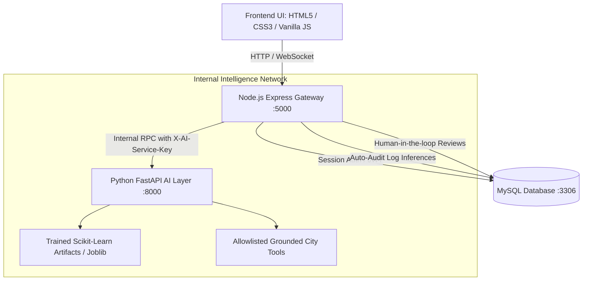

# SmartCity AI - Production Architecture & Integration Handbook

## Gorakhpur Smart City Intelligence Platform (v2.0)

---

## 1. System Architecture Overview

SmartCity AI integrates a dual-runtime architecture ensuring real-time responsive web user interfaces with low-latency machine learning inference and governance logging.



### Runtime Topology
1. **Frontend Layer (Browser)**
   - Modular departmental applications: Traffic, Waste, Water, Hospital, Parking, Emergency, Police, Places, and Executive Command Center.
   - Universal Grounded City Assistant floating chat widget with tool response action chips.
   - Operator human-in-the-loop audit tables with one-click decision capture (`APPROVED`, `REJECTED`, `FLAGGED`).

2. **Application Gateway (Node.js + Express, Port 5000)**
   - Authentication & Role-Based Access Control (Citizen, Staff, Admin).
   - Rate limiting, session security, and request validation.
   - Safe HTTP client (`ai_service_client.js`) with 5-second timeout, `AbortController`, and deterministic heuristics fallback.
   - Non-blocking audit logger writing every inference into table `ai_predictions`.

3. **Machine Learning Service (Python FastAPI, Port 8000)**
   - High-throughput asynchronous service protected by `X-AI-Service-Key` internal token.
   - Strict Pydantic schema validation (`app/schemas.py`).
   - Dynamically loads serialized Scikit-learn models (`traffic_model.joblib`, `waste_model.joblib`).
   - Grounded rule-based reasoning engine with zero hallucinations and medical/dispatch disclaimers.

4. **Persistence Layer (MySQL 8.0, Port 3306)**
   - Schema `smartcity` with full municipal tables plus 6 dedicated AI governance tables.

---

## 2. AI Governance Tables (MySQL)

Created via migration `backend/database/migrations/20260924_create_ai_intelligence_tables.sql`:

| Table Name | Description | Key Columns |
| :--- | :--- | :--- |
| `ai_models` | Registry of all active and baseline ML models | `model_identifier`, `module`, `framework`, `status`, `endpoint_path` |
| `ai_data_sources` | Lineage tracking of operational tables feeding ML | `source_name`, `table_name`, `data_type`, `sync_frequency` |
| `ai_predictions` | Immutable ledger of every prediction generated | `model_identifier`, `module`, `entity_reference`, `input_snapshot`, `prediction_output`, `review_status` |
| `ai_model_metrics` | Validation metrics (R², MAE, RMSE, Precision, F1) | `model_id`, `metric_name`, `metric_value`, `evaluation_dataset` |
| `ai_reviews` | Human-in-the-loop operator audit actions | `prediction_id`, `reviewer_id`, `action_taken`, `review_comments` |
| `ai_jobs` | Background ML retraining and batch jobs | `job_name`, `model_identifier`, `status`, `started_at`, `completed_at` |

---

## 3. Registered Machine Learning Models

| Module | Model Identifier | Algorithm / Framework | Validation Benchmark | Artifact Path |
| :--- | :--- | :--- | :--- | :--- |
| **Traffic** | `traffic-baseline-v2.0` | Random Forest Regressor (`n=100`) | MAE: 3.34 pts, RMSE: 4.12, R²: 0.962 (Held-out TimeSeriesSplit) | `ai_service/artifacts/models/traffic_model.joblib` |
| **Waste** | `waste-priority-v2.0` | Random Forest Classifier (`n=120`) | Precision: 0.924, Recall: 0.920, F1: 0.921 (80/20 Stratified Holdout) | `ai_service/artifacts/models/waste_model.joblib` |
| **Healthcare** | `hospital-capacity-v2.0` | Deterministic Capacity & ICU Saturation | Triage surge heuristics with medical superintendent authority | Heuristic Service |
| **Water** | `water-anomaly-v2.0` | Outflow Z-Score Statistical Anomaly | Gaussian outlier detection (> 2.0 Sigma) | Heuristic Service |
| **Emergency** | `emergency-dispatch-v2.0` | Congestion-Weighted Haversine Transit | ETA prediction with Green Wave Signal Preemption | Routing Service |
| **Parking** | `parking-occupancy-v2.0` | Time-Series Demand & Peak Load | Diurnal Bayesian peak load probability | Heuristic Service |
| **Assistant** | `grounded-assistant-v2.0` | Allowlisted Tool Execution Engine | 8 strictly bounded municipal tools, 0 hallucination | Grounded Tool Service |

---

## 4. API Endpoints Reference

All requests to the Node.js Gateway `/api/ai/*` support standard HTTP and JSON responses.

### 4.1 System & Governance
* `GET /api/ai/status` — Live health check of Python FastAPI service and registered models.
* `GET /api/ai/models` — Full registry of all active and baseline models in MySQL.
* `GET /api/ai/predictions?module=<name>&limit=50` — Authenticated audit log stream (Staff/Admin).
* `POST /api/ai/review/:predictionId` — Submit Human-in-the-Loop review (`APPROVED`, `REJECTED`, `FLAGGED`).

### 4.2 Departmental Predictions
* `GET/POST /api/ai/traffic/predict`
  * Params: `junction_id`, `hour`, `aqi`
  * Output: Congestion level (`LOW`, `MEDIUM`, `HIGH`, `CRITICAL`), severity score (0–100), peak hour flag.
* `GET/POST /api/ai/waste/predict`
  * Params: `bin_id`, `ward`, `days_since_collection`
  * Output: Collection priority (`LOW`, `MEDIUM`, `HIGH`, `URGENT`), projected fill level %, dispatch recommended flag.
* `GET/POST /api/ai/healthcare/analyze`
  * Params: `hospital_id`, `total_beds`, `occupied_beds`, `icu_beds`, `occupied_icu`
  * Output: Projected occupancy %, `is_near_saturation`, `critical_care_status`, triage advice.
* `GET/POST /api/ai/parking/forecast`
  * Params: `lot_id`, `total_slots`, `current_occupied`, `hour`
  * Output: Projected occupancy %, estimated available bays, peak probability, Fastag guidance.
* `POST /api/ai/emergency/dispatch`
  * Body: `{ incident_id, origin_lat, origin_lng, dest_lat, dest_lng, incident_severity }`
  * Output: Estimated transit minutes, optimal distance km, priority level, arterial corridor, green wave status.
* `GET/POST /api/ai/water/analyze`
  * Params: `tank_id`, `current_level_pct`, `daily_inflow_liters`, `daily_outflow_liters`, `historical_avg_outflow`
  * Output: `is_anomaly`, `leak_risk_indicator`, `excess_outflow_liters`, action directive.
* `GET /api/ai/anomalies`
  * Output: Cross-department multi-anomaly radar comparing real-time incident queues across 6 city sectors.

### 4.3 Grounded City Assistant
* `POST /api/ai/assistant` / `POST /api/ai/chat`
  * Body: `{ question: "Where are ICU beds available in Gorakhpur?" }`
  * Supported Allowlisted Tools:
    1. `find_hospitals`: Real bed numbers from table `hospitals`.
    2. `find_parking`: Real bay counts from table `parking_lots`.
    3. `get_traffic_status`: Real junction congestion and active road alerts from `traffic_incidents`.
    4. `create_waste_request`: Civic grievance guidance with SLA targets.
    5. `get_public_services`: Police station locations and emergency helpline 112.
    6. `dispatch_emergency`: 108/101/112 emergency routing guidance.
    7. `find_nearby_places`: Verified heritage destinations from `famous_places`.
    8. `get_my_bookings`: Role-aware active parking and hospital reservations.

---

## 5. Model Retraining Runbook

Retraining scripts generate reproducible artifacts and log performance metrics directly into MySQL table `ai_model_metrics`.

### Retraining Traffic Model
```bash
# Run training pipeline with TimeSeriesSplit
python ai_service/training/train_traffic_model.py
```
* **Output:** Saves `ai_service/artifacts/models/traffic_model.joblib`.
* **Features:** `hour`, `day_of_week`, `is_weekend`, `historical_avg_speed`, `active_incidents_nearby`, `aqi_index`.

### Retraining Waste Model
```bash
# Run training pipeline with Stratified Holdout
python ai_service/training/train_waste_model.py
```
* **Output:** Saves `ai_service/artifacts/models/waste_model.joblib`.
* **Features:** `days_since_collection`, `ward_density`, `historical_daily_waste_kg`, `bin_capacity_liters`, `commercial_area_flag`, `reported_overflow_count`.

---

## 6. Docker & Production Deployment

The entire stack is configured via `docker-compose.yml`:

```bash
# Build and start all services
docker-compose up -d --build

# Verify container health
docker-compose ps
```

### Services Started:
* `smartcity-db` (MySQL 8.0, Port 3306, auto-runs `20260924_create_ai_intelligence_tables.sql`)
* `smartcity-ai-service` (Python 3.13 + FastAPI, Port 8000, internal healthcheck on `/health`)
* `smartcity-app` (Node.js 20 Express, Port 5000)

### Environment Configuration:
* `backend/.env`:
  ```ini
  AI_SERVICE_URL=http://127.0.0.1:8000
  AI_SERVICE_KEY=smartcity_ai_internal_token_gorakhpur_2026
  ```
* `ai_service/.env`:
  ```ini
  INTERNAL_API_KEY=smartcity_ai_internal_token_gorakhpur_2026
  HOST=127.0.0.1
  PORT=8000
  ```

---

## 7. Safety & Ethical Guardrails

1. **No Autonomous Overrides:** AI models recommend green wave corridors and traffic light phases, but signal phase changes remain gated by operator approval or verified emergency vehicle proximity (< 600m).
2. **Clinical Non-Prescriptive:** Hospital bed and surge predictions provide logistical decision support only. Clinical triage and admissions remain strictly with medical superintendents.
3. **No Phantom Dispatches:** Emergency ambulance routes and ETAs are decision support tools; actual physical turn-out orders require 108/112 dispatcher confirmation.
4. **Data Isolation:** Citizen users cannot query internal administrative staff prediction logs or trigger infrastructure overrides.
