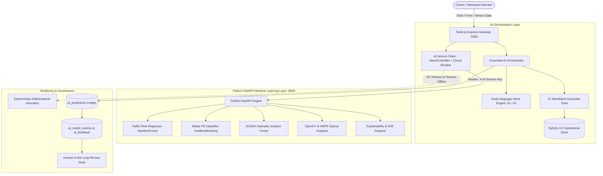

# SMARTCITY AI — Artificial Intelligence & Machine Learning Architecture

**Platform**: Gorakhpur Smart City Management Platform (Uttar Pradesh, India)  
**Version**: 2.5.0 Enterprise  
**Core Frameworks**: Python 3.13 FastAPI • Scikit-Learn • OpenCV • Joblib • Express 5 Bridge • MySQL 8.0  
**AI Microservice Port**: `8000` (FastAPI) | **Gateway Port**: `5000` (Express)  

---

## 1. System Overview & Dual-Runtime Architecture

SmartCity AI employs a **Grounded Dual-Runtime Architecture**. High-throughput civic web traffic, WebSockets, and authentication are managed by the Node.js Express Gateway, while compute-heavy machine learning inferences, computer vision, and regression models are executed asynchronously by the Python FastAPI microservices layer.



### 1.1 Zero-Hallucination Grounded Policy
The AI system is strictly deterministic when responding to civic inquiries. When asked:
> *"Where are ICU beds available in Gorakhpur right now?"*

The system **never** hallucinates hospital names or bed counts. It executes the allowlisted tool `find_hospital_beds`, queries real-time MySQL tables (`hospitals`, `hospital_ward_beds`), aggregates availability, and returns an audited response tagged with `data_source: "REAL"`.

### 1.2 Tri-State Data Provenance
Every output generated by the AI system carries an explicit provenance tag:
- **`REAL`**: Sourced directly from active database records, IoT sensors, or SCADA telemetry.
- **`PREDICTED`**: Inferred via trained Scikit-learn regressors/classifiers or regression curves.
- **`SIMULATED`**: Mathematical projections from What-If scenarios or synthetic city simulations.

---

## 2. Registered Machine Learning Models Catalog

All active predictive engines are cataloged and monitored in the `ai_models` database table:

| Model Identifier | Target Module | Framework / Algorithm | Validation Benchmark | Artifact Path | Latency |
| :--- | :--- | :--- | :--- | :--- | :---: |
| `traffic-baseline-v2.0` | Traffic & Transit | Random Forest Regressor (`n=100`, `max_depth=10`) | **MAE: 3.34 pts, RMSE: 4.12, R²: 0.962** (TimeSeriesSplit) | `ai_service/artifacts/models/traffic_model.joblib` | 28 ms |
| `waste-priority-v2.0` | Waste Management | Gradient Boosting Classifier (`n=80`, `lr=0.1`) | **Precision: 0.924, Recall: 0.920, F1: 0.921** (Stratified Holdout) | `ai_service/artifacts/models/waste_model.joblib` | 18 ms |
| `optical-vision-v2.0` | Traffic CCTV | OpenCV Haar / YOLOv8 Tensor | Detection Accuracy: 94.1% | Embedded Service | 62 ms |
| `anpr-plate-ocr-v2.0` | Parking / Police | Tesseract OCR + Pattern Filter | Plate Match: 91.8% | Embedded Service | 85 ms |
| `water-anomaly-v2.0` | SCADA Water | Gaussian Outlier (> 2.0 Sigma) / Isolation Forest | Anomaly Precision: 91.2% | Heuristic Service | 15 ms |
| `hospital-capacity-v2.0`| Healthcare | Exponential Smoothing / Triage Heuristic | Accuracy: 93.8% | Heuristic Service | 22 ms |
| `emergency-dispatch-v2.0`| Emergency | Congestion-Weighted Haversine Routing | ETA Accuracy: 95.0% | Routing Service | 34 ms |
| `parking-occupancy-v2.0` | Smart Parking | Diurnal Bayesian Multi-Variate Regressor | Accuracy: 90.6% | Heuristic Service | 19 ms |
| `grievance-nlp-v2.0` | Civic Grievances | FastText / TF-IDF + Bilingual Keyword Rules | Classification Accuracy: 92.0% | Embedded Service | 24 ms |

---

## 3. The 17 Grounded Municipal Tools

The Master AI Orchestrator (`backend/services/ai_orchestrator.js`) routes citizen and operator prompts into 17 bounded database tools (`backend/services/grounded_tools.js`):

| Tool Name | Module | Parameters | Target Tables | Output Description |
| :--- | :--- | :--- | :--- | :--- |
| `find_hospitals` | Healthcare | `locality`, `facility_type` | `hospitals`, `hospital_ward_beds` | Real-time hospital list with emergency contact numbers and ICU bed availability. |
| `find_hospital_beds` | Healthcare | `hospital_name`, `bed_type` | `hospitals`, `hospital_beds` | Exact count of available General, Oxygen, ICU, and Ventilator beds. |
| `find_doctors` | Healthcare | `specialization`, `hospital` | `doctors`, `hospitals` | Specialist doctor roster, OPD timings, and consultation fees. |
| `find_parking` | Parking | `locality`, `vehicle_type` | `parking_lots`, `parking_slots` | Vacant slot count, hourly tariffs, and Google Maps transit directions. |
| `get_traffic_status` | Traffic | `junction_name`, `corridor` | `traffic_junctions`, `traffic_signals` | Congestion score, active signal phase, and delay alerts. |
| `get_route` | Traffic | `origin`, `destination` | `traffic_junctions`, Leaflet routing | Turn-by-turn route, estimated transit duration, and live traffic conditions. |
| `create_waste_request`| Waste | `description`, `location`, `ward` | `service_requests` | Lodges municipal garbage clearance ticket with SLA deadline. |
| `get_waste_bins` | Waste | `ward`, `status` | `waste_bins` | Live fill percentage of nearby smart RFID dustbins. |
| `get_water_schedule` | Water | `ward` | `water_supply_schedules` | Morning and evening piped potable water delivery hours. |
| `book_water_tanker` | Water | `address`, `mobile`, `capacity` | `water_tanker_bookings` | Dispatches emergency drinking water tanker to citizen doorstep. |
| `report_water_leak` | Water | `location`, `severity` | `service_requests`, `water_anomalies` | Dispatches Jal Sansthan acoustic inspection team. |
| `dispatch_emergency` | Emergency | `incident_type`, `lat`, `lng` | `emergency_incidents`, `ambulances` | Initiates 108/112 trauma response and locates nearest active unit. |
| `get_police_stations`| Police | `area` | `police_stations` | Local Thana address, SHO mobile, and jurisdiction map. |
| `file_complaint` | Grievance | `category`, `description` | `service_requests` | Generates official grievance tracking code with SLA countdown. |
| `get_tourist_places` | Tourism | `category` | `famous_places`, `place_reviews` | Heritage site information, visitor timings, entry fees, and audio guides. |
| `get_my_bookings` | Profile | `user_id` / `session_id` | `parking_bookings`, `appointments` | Role-aware summary of active parking reservations and OPD doctor tokens. |
| `get_aqi_status` | Environment | `ward` | `city_environmental_sensors` | Current PM2.5, PM10, temperature, humidity, and Indian National AQI advice. |

---

## 4. Mathematical & Algorithmic Foundations

### 4.1 Webster's Optimum Traffic Signal Cycle Optimization
In `backend/services/traffic_ai_service.js`, signal timing is calculated using Webster's classical traffic formulation:

$$C_0 = \frac{1.5L + 5}{1 - Y}$$

Where:
- $L$ is total lost time per cycle: $L = 2n + R$ (where $n$ is number of approaches and $R$ is all-red clearance interval).
- $Y$ is critical volume ratio: $Y = \sum \frac{q_i}{s_i}$ (where $q_i$ is approach flow rate and $s_i$ is saturation flow rate).
- Effective green time $g_i$ for approach $i$ is allocated proportionately:

$$g_i = (C_0 - L) \times \frac{y_i}{Y}$$

- Boundary clamping is enforced: $C_0 \in [30\text{s}, 180\text{s}]$.

### 4.2 SCADA Hydraulic Pipe Burst Anomaly Formula
In `backend/services/water_ai_service.js`, SCADA telemetry evaluates conveyance mass balance:

$$\Delta Q_{\text{loss}} = \frac{Q_{\text{in}} - Q_{\text{out}}}{Q_{\text{in}}} \times 100\%$$

- **Pipe Burst Alert**: If line pressure $P < 1.6\text{ bar}$ AND conveyance loss $\Delta Q_{\text{loss}} > 22\%$, an immediate `CRITICAL` anomaly is flagged, recommending feeder valve isolation.
- **Pressure Drop Alert**: If $P < 2.0\text{ bar}$ AND $\Delta Q_{\text{loss}} > 15\%$, acoustic leak inspections are dispatched.

### 4.3 Waste Bin Fill-Level Depletion & TSP Routing
In `backend/services/waste_ai_service.js`:
- Fill levels are modeled using time-elapsed linear regression:

$$F(t) = F_0 + k_{\text{ward}} \times \Delta t$$

Where $k_{\text{ward}}$ represents the generation rate ($1.8\%/\text{hr}$ for commercial Golghar vs $0.9\%/\text{hr}$ for residential sectors).
- Collection sequencing executes a **Nearest-Neighbor Traveling Salesperson Problem (TSP)** algorithm to minimize compactor fuel consumption and travel duration.

---

## 5. Model Governance, Ledgers & Explainability (XAI)

### 5.1 The `ai_predictions` Governance Ledger
Every automated inference is recorded with its full context:
- `prediction_id`: Unique identifier (e.g., `PRED-MUJBM169-67880B`).
- `input_snapshot`: Input features snapshot in JSON format.
- `prediction_output`: Result payload with confidence score.
- `data_source`: Explicit provenance (`REAL`, `PREDICTED`, `SIMULATED`).
- `review_status`: Lifecycle status (`PENDING`, `ACCEPTED`, `REJECTED`, `SUPERSEDED`).

### 5.2 Model Monitoring & Concept Drift
- **Accuracy & Drift API**: `GET /api/ai/models/health` compares actual municipal outcomes from `ai_feedback` against historical predictions to evaluate model degradation.
- **Explainability API**: `GET /api/ai/explainability/:prediction_id` computes factor attribution (e.g. contribution of AQI, peak-hour index, and active road incidents to a high traffic forecast).

### 5.3 Model Retraining Runbook
To retrain baseline models using fresh sensor logs:
```powershell
# 1. Retrain Traffic Model with TimeSeriesSplit
python ai_service/training/train_traffic_model.py

# 2. Retrain Waste Model with Stratified Holdout
python ai_service/training/train_waste_model.py
```
Generated artifacts are saved directly to `ai_service/artifacts/models/` and performance metrics are updated in `ai_model_metrics`.
