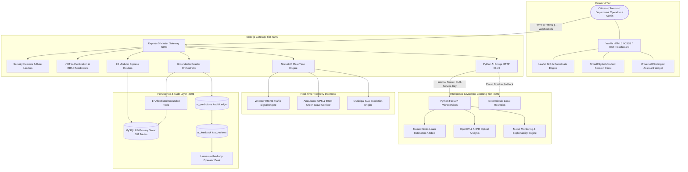

# SMARTCITY AI — System Architecture Specification

**Platform**: Gorakhpur Smart City Management Platform (Uttar Pradesh, India)  
**Version**: 2.5.0 Enterprise  
**Architecture Style**: Event-Driven Multi-Tier Micro-Modular Architecture with Grounded Dual-Runtime AI  
**Active Services**: Express 5 Core Gateway (Port 5000) • MySQL 8.0 Pool (Port 3306) • Python FastAPI ML Engine (Port 8000) • Socket.IO WebSockets • Leaflet GIS Client  

---

## 1. High-Level Architecture Overview

SmartCity AI is architected as a high-concurrency, municipal-grade operating system designed to optimize, automate, and govern urban operations across Gorakhpur. The platform decouples fast web routing and transaction management from compute-intensive machine learning workloads through a unified dual-runtime structure:



---

## 2. Core Architectural Principles

### 2.1 Zero-Hallucination Grounded Execution
The AI assistant and predictive controllers are strictly bound to execute allowlisted database tools (`backend/services/grounded_tools.js`). The system never invents or guesses civic data (such as hospital beds, parking slots, or grievance statuses). Queries query verified operational tables (`hospitals`, `hospital_ward_beds`, `parking_lots`, `service_requests`) and return audited responses tagged with explicit provenance.

### 2.2 Strict Tri-State Data Source Attribution
Every endpoint, prediction card, table row, and widget response in the platform carries an explicit provenance tag:
- **`REAL`**: Real-time ground truth from IoT sensors, SCADA telemetry, or active database records.
- **`PREDICTED`**: Machine learning inferences, regression projections, or classification outputs.
- **`SIMULATED`**: Mathematical simulations, What-If projections, or hypothetical synthetic events.

### 2.3 Human-in-the-Loop (HITL) High-Consequence Safeguards
High-consequence civic actions never execute autonomously:
1. **Automated E-Challan Staging**: Computer vision algorithms identify speed and red-light infractions, classifying them strictly as `AI_FLAGGED`. The official fine referral only occurs when a traffic officer reviews the evidence image and signs off (`/api/cv/violations/:id/verify`).
2. **Medical Privacy & QR Codes**: Patient clinical charts are strictly protected. Scanning a patient QR without an authorized `DOCTOR`, `HOSPITAL_STAFF`, or `ADMIN` role returns an immediate privacy-masked public confirmation (`403 Forbidden` for full records).
3. **Emergency Corridor Signals**: Preemption waves trigger within 600m of an active ambulance and log full audit timestamps.
4. **Clinical Non-Prescriptive Boundary**: Hospital bed and surge predictions provide logistical decision support only. Admissions and triage authority remain strictly with medical superintendents.

---

## 3. Tier-by-Tier Component Breakdown

### 3.1 Client Browser Tier
- **Technology Stack**: Vanilla JavaScript (ES6+), Vanilla CSS3 Design System with HSL tokens, HTML5.
- **GIS Mapping**: Interactive Leaflet maps (`[26.7606, 83.3732]` Gorakhpur base) across Home, Traffic, Parking, Healthcare, Waste, Water, Police, and Tourism modules with marker clustering, polygon zones, and dynamic route rendering (`leaflet-routing-machine`).
- **Unified Authentication Client (`frontend/auth.js`)**:
  - Global `SmartCityAuth` singleton managing JWT lifecycle, persona switching, and role validation.
  - Mounts unified profile circles, notification drawers, activity timeline, and Ayushman QR pass across all pages.
  - Cross-tab session synchronization via `window.addEventListener('storage', ...)`.

### 3.2 Application Gateway Tier (`backend/server.js`)
- **Express 5 Gateway Engine**: Non-blocking asynchronous event loop with native Promise support on Port `5000`.
- **Security Pipeline**:
  - `securityHeadersMiddleware`: Enforces `X-Content-Type-Options: nosniff`, `X-Frame-Options: SAMEORIGIN`, `X-XSS-Protection`, and `Referrer-Policy`.
  - `cors`: Restricts cross-origin requests to configured domains.
  - `rateLimiters`: Configured specifically per endpoint category (general API: 300 req/15min, SOS emergency: 10 req/1min, auth login: 20 req/15min).
  - `authenticateToken` / `optionalToken`: JWT verification extracting `req.user` payload.
  - `requireRole` & Departmental Guards: Enforces module-level RBAC (`traffic`, `hospital`, `parking`, `waste`, `water`, `emergency`, `police`).

### 3.3 Real-Time Telemetry & Simulation Subsystems
- **Traffic Signal Engine (`backend/services/traffic_engine.js`)**:
  - Simulates active traffic phases across 42 city junctions (9 major arterial junctions).
  - Dynamically recalculates green splits every second based on Webster's IRC:93 minimum delay formula and live congestion density.
- **Ambulance GPS & Green Wave Engine (`backend/services/ambulance_simulator.js`)**:
  - Tracks 6 simulated emergency ambulances moving along defined GPS waypoints between trauma centers and critical accident zones.
  - Triggers automated green wave preemption when an emergency vehicle approaches within 600m of a junction.
- **SLA Escalation Engine (`backend/services/sla_engine.js`)**:
  - Monitors citizen grievances every 60 seconds against SLA thresholds (2h Critical, 6h High, 24h Medium, 48h Low).
  - Automatically flags overdue tickets for administrative escalation.

### 3.4 Python Machine Learning Microservices Tier (Port 8000)
- **FastAPI / Uvicorn Service**:
  - High-throughput asynchronous service protected by `X-AI-Service-Key` mutual header.
  - Strict Pydantic schema validation (`app/schemas.py`).
  - Serialized Scikit-learn models (`traffic_model.joblib`, `waste_model.joblib`).
  - Computer Vision & ANPR OCR pipeline (OpenCV Haar cascades / YOLOv8 / Tesseract OCR).
  - Fallback Circuit Breaker (`backend/services/ai_service_client.js`): If the Python ML service is unreachable, Node.js gracefully falls back to deterministic mathematical heuristics with zero downtime.

### 3.5 Persistence & Governance Tier (MySQL 8.0, Port 3306)
- **Primary Schema**: 101 active relational tables managed via `mysql2/promise` connection pool (max 20 connections).
- **AI Audit Ledgers**:
  - `ai_predictions`: Immutable ledger of every inference with input snapshots, output JSON, confidence, and provenance tags.
  - `ai_feedback`: Ground-truth outcomes submitted by municipal inspectors or citizens to track precision and drift.
  - `ai_tool_logs`: Tamper-proof execution log of allowlisted tools.
  - `ai_reviews`: Human-in-the-loop review log capturing operator sign-offs.

---

## 4. Operational Request Lifecycles

### 4.1 Citizen Bilingual Query Flow
```
User (Browser) 
  ──> POST /api/ai/chat { message: "Golghar ke paas parking aur ICU beds kaha hain?" }
  ──> Gateway (Node.js :5000) verifies token (optional)
  ──> AI Orchestrator classifies dual-intent ("find_parking", "find_hospital_beds")
  ──> Executes grounded tools against MySQL (parking_lots, hospital_ward_beds)
  ──> Synthesizes factual bilingual reply + actionable deep-links
  ──> Logs inference into `ai_predictions` ledger
  ──> Returns JSON response { reply, data_source: "REAL", confidence: 0.94 }
```

### 4.2 Ambulance Green Wave Emergency Preemption Flow
```
Ambulance Telemetry (GPS Loop or Dispatch API)
  ──> POST /api/traffic/ambulance-preemption { ambulance_id: "AMB-01", lat, lng, junction_id }
  ──> Gateway calculates distance to target junction
  ──> If distance <= 600m:
        * Engaging preemption wave on approaching arterial corridor
        * Forces green phase on emergency approach; holds conflicting approaches at red
        * Broadcasts 'traffic:signal-updated' via Socket.IO to connected dashboards
        * Records event in `ambulance_green_waves` audit ledger
  ──> Returns HTTP 200 { preemption_active: true, corridor_status: "GREEN_WAVE_ENGAGED" }
```

### 4.3 Computer Vision Violation Staging Flow
```
CCTV Telemetry / ANPR Stream
  ──> POST /api/cv/analyze { junction_id, frame_data }
  ──> CV ANPR Service runs vehicle detection & OCR plate recognition
  ──> Infraction detected (e.g. Red Light Jump)
  ──> Staged in `traffic_violations` table with status `AI_FLAGGED`
  ──> Traffic Officer opens Verification Queue in Traffic Dashboard
  ──> Officer inspects frame and plate: POST /api/cv/violations/:id/verify { decision: "APPROVE" }
  ──> Status transitions to `VERIFIED_CHALLAN_REFERRED` with officer credentials
  ──> Citizen can now view and pay e-Challan via UPI / gateway
```

---

## 5. Security & Network Topology

```
Internet / Public Traffic
          │
          ▼
┌─────────────────────────────────────────┐
│ Nginx Reverse Proxy (Port 80 / 443 SSL) │
│ - Gzip compression & static caching     │
│ - SSL termination (Let's Encrypt)       │
└────────────────────┬────────────────────┘
                     │
          ┌──────────┴──────────┐
          │                     │
          ▼                     ▼
┌───────────────────┐ ┌───────────────────┐
│ Static Frontend   │ │ Node.js Express 5 │
│ (Port 3000 / WWW) │ │ Gateway (Port 5000│
└───────────────────┘ └─────────┬─────────┘
                                │
               ┌────────────────┴────────────────┐
               │ Internal Docker / Local Network │
               ▼                                 ▼
    ┌──────────────────────┐          ┌──────────────────────┐
    │ MySQL 8.0 Database   │          │ Python FastAPI ML    │
    │ (Port 3306)          │          │ Engine (Port 8000)   │
    └──────────────────────┘          └──────────────────────┘
```

1. **Port Isolation**: Python FastAPI (:8000) and MySQL (:3306) bind strictly to `127.0.0.1` or internal Docker network. Only Node.js (:5000) and Nginx (:80/:443) face client ingress.
2. **Mutual Internal Secret**: All Node.js calls to Python FastAPI carry the internal header `X-AI-Service-Key`.
3. **Graceful Shutdown**: The Node.js gateway drains active connections, flushes prediction logs, and halts simulation loops cleanly on `SIGTERM`/`SIGINT`.
